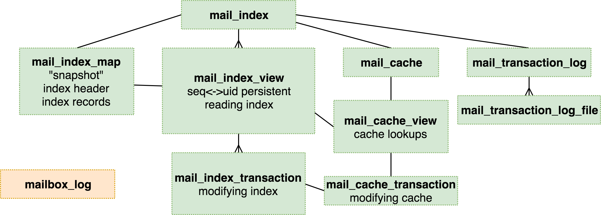
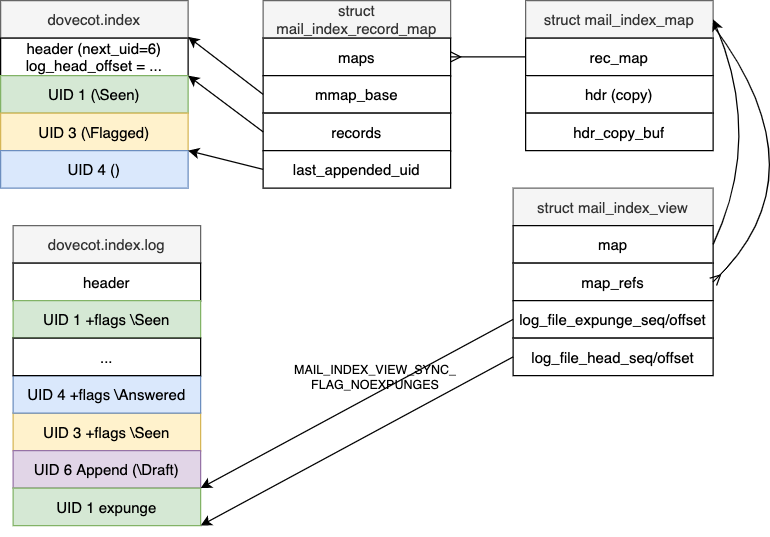

# Mail Index API

::: info See Also
See [Mail Indexes](index_format) for an overview of what the cache does.
:::

`lib-index/mail-index.h` contains the functions to access the index
files. `mail-cache.h` contains the functions to access the cache file.

The purpose of the main structures are:

* `struct mail_index`: Global state of the index.

* `struct mail_index_view`: View into the mailbox state, which contains
  the mail sequence &lt;-&gt; UID mapping. The views see new messages come and
  expunged messages go only when it's being explicitly synchronized.
  However, the record data (flags, keywords, extensions) can change without
  syncing. This is normally the wanted behavior anyway (e.g. there's no point
  accessing obsolete cache file offsets). An index can have many views.
  In lib-storage each `struct mailbox` has a single view.

* `struct mail_index_map`: Index file is read via maps. A view has its
  primary map, but it can also reference other newer maps to return latest
  record data. Maps can be shared by different views. Maps can contain either
  mmap()ed memory areas pointing to the index file, or an in-memory copy of it.

* `struct mail_index_transaction`: In-memory list of changes to be
  written to the transaction log. The writing is done only when the
  transaction is committed.

* `struct mail_transaction_log`: Global state of the transaction log.

* `struct mail_transaction_log_file`: State of an opened transaction log
  file.

* `struct mail_cache`: Global state of the cache file.

* `struct mail_cache_view`: View for reading the cache file. The cache view
  references an index view.

* `struct mail_cache_transaction`: Transaction for modifying the cache file.
  A transaction references a cache view and index transaction.

See `lib-index/*.h` in the source code for details about these structs.

## Views and Maps

The mail index API provides access to messages primarily using their message
sequence number (MSN). This is the same as the IMAP MSNs. The first message
has MSN=1, the second message 2 and so on. When a message is expunged, the MSNs
change for all the messages following it. This means that the MSNs are highly
stateful and can't be used as any kind of a permanent pointer to the message.
IMAP UIDs provide such a permanent pointer instead (until UIDVALIDITY changes).

MSNs are always attached to a specific "view". The MSNs within the view don't
change until an explicit "view sync" is performed. There can be multiple views
to the same folder with different MSN mappings. This means that a view may
include messages that have already been expunged. Their index record data is
still available though, and their `dovecot.index.cache` data may also be still
available.

There are APIs to convert between MSNs and UIDs. Converting UID to MSN
requires doing a binary search through all the message records. It's fast, but
still better avoided if not needed. This is one reason why all the API
functions use MSNs instead of UIDs. Another reason is that IMAP protocol
requires access by MSN in any case, so supporting MSNs directly makes them
more efficient. The main downside to using MSNs is that whenever a message is
expunged, we memmove() all the message data after it over the expunged
message. This is typically not a big problem, because users usually expunge
only new mails so the memmove()d size is rather small. If multiple mails are
expunged at once, we'll also optimize so that we don't memmove() the same data
multiple times. (The first Dovecot 0.99.x versions attempted to avoid this
memmove() by tracking the mails in a binary tree, but this was optimizing a
rarely problematic access pattern at the expense of a normal access pattern.)

### Maps

A view points to a map, which points to a rec_map
(`struct mail_index_record_map`).

The rec_map can be thought of as a mmap() of the index file. So the rec_map is
the one that actually contains all the mail records. Multiple views can
point to the same shared map, and multiple maps can point to the same shared
rec_map. When messages are appended or expunged, the shared maps are copied
into private maps.

Maps are updated whenever index file is refreshed, which can happen any
time, not just when syncing index/view. The map is first built by reading
or mmap()ing the `dovecot.index` file. The index header contains the file
seq/offset to `dovecot.index.log` to indicate at which position it was
created. All changes after this offset need to be read from the log and applied
on top of the initial index. Later on when a map is being refreshed, only
new changes from the `dovecot.index.log` file are read and applied.

### View Syncing

Views are always synced up to a specific `dovecot.index.log` file seq/offset.
IMAP protocol doesn't allow EXPUNGE notifications to be sent to the client in
all situations, so a view sync can optionally sync the expunges or leave them
to be synced later. This is why there are both "expunge" and "head"
seq/offsets. The "expunge" points how far expunges have been synced, and the
"head" how far everything else has.

View syncing returns a list of flag changes and modseq changes that happened
during the sync. This is used to send change notifications to the IMAP
sessions and for syncing virtual mailboxes.

It's possible that if a view hasn't been synced for a long time, it can point
to a log file that has been rotated a few times already and no longer exists.
In this situation Dovecot compares the original view's map and the latest map
to find out the changes.

### View APIs

For accessing messages with their UIDs, you'll first need to convert
them to sequences with either `mail_index_lookup_uid()` or
`mail_index_lookup_uid_range()`.

`mail_index_lookup()` can be used to look up a single record's UID and
flags. The returned record points to the latest map, so that it contains
the latest flag and extension changes. If the message was already expunged
from the latest map, it returns the old contents from the view's map.
It's possible to find out whether a mail has been expunged from the latest
map with `mail_index_is_expunged()`.

`mail_index_lookup_full()` and `mail_index_lookup_ext_full()` can be
used to return also the map where the message was found. This can be important
with index extensions. If the extension record's state depends on the extension
header or its reset_id, they must be looked up from the same map. For this
reason there exists `mail_index_map_get_header_ext()` and other functions
which take the map as parameter. For example a cache file offset that was
looked up must be verified to be compatible with the current cache file by
comparing the reset_id in the map vs cache file header.
