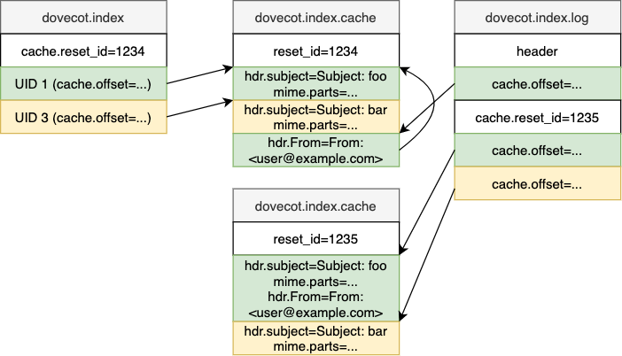

# Mail Index Cache

::: info
See Also:
* [Mail Indexes](index_format) for an overview of what the cache does.
:::

## Client Types

IMAP clients can work in many different ways. There are basically 2
types:

1. Online clients that ask for the same information multiple times (e.g.
   webmails, Pine)

2. Offline clients that usually download first some of the interesting
   message headers and only after that the message bodies (possibly
   automatically, or possibly only when the user opens the mail). Most
   non-webmail IMAP clients behave like this.

Cache file is extremely helpful with the type 1 clients. The first time
that client requests message headers or some other metadata they're
stored into the cache file. The second time they ask for the same
information Dovecot can now get it quickly from the cache file instead
of opening the message and parsing the headers.

For type 2 clients the cache file is also somewhat helpful if client
fetches any initial metadata. Some of the information is helpful in any
case, for example it's required to know the message's virtual size when
downloading the message with IMAP. Without the virtual size being in cache
Dovecot first has to read the whole message first to calculate it, which
increases CPU usage.

Only the specified fields that client(s) have asked for earlier are
stored into cache file. This allows Dovecot to be adaptive to different
clients' needs and still not waste disk space (and cause extra disk
I/O!) for fields that client never needs. Although this behavior is
configurable with [[setting,mail_cache_fields]]],
[[setting,mail_always_cache_fields]], and [[setting,mail_never_cache_fields]]
settings.

Dovecot can cache fields either permanently or temporarily. Temporarily
cached fields are dropped from the cache file after about a week.
Dovecot uses two rules to determine when data should be cached
permanently instead of temporarily:

1. Client accessed messages in non-sequential order within this session.
   This most likely means it doesn't have a local cache.

2. Client accessed a message older than one week.

These rules might not always work optimally, so Dovecot also re-evaluates
the caching decisions once in a while:

* When caching decision is YES (permanently cache the field), the field's
  last_used is updated only when the caching decision has been verified to
  be correct.

* When caching decision is TEMP, the last_used is updated whenever the field
  is accessed.

* When last_used becomes 30 days old (or
  [[setting,mail_cache_unaccessed_field_drop]]) a YES caching
  decision is changed to TEMP.

* When last_used becomes 60 days old (or 2 *
  [[setting,mail_cache_unaccessed_field_drop]]) a TEMP caching
  decision is changed to NO.

## File Format

There are two versions of the cache file format. Both of them can always be
read. The v2 format is written when [[setting,dovecot_storage_version]] is
high enough, otherwise the v1 format is written. An existing file keeps its
format until it's purged. The base header's `major_version` is 1 for v1 files
and 2 for v2 files. Older Dovecot versions support only v1 files, and they
delete v2 files as corrupted.

### Version 1

The cache file format is:

* Base header (`struct mail_cache_header`).
* List of `struct mail_cache_header_fields` or `struct mail_cache_record`.

After the base header it can't be assumed what the rest of the file contains.
Everything after it must be accessed via provided file offsets.

The list of cached fields exists in `struct mail_cache_header_fields`.
The initial offset to it is in `mail_cache_header.field_header_offset`.
The following updates are written to `mail_cache_header_fields.next_offset`,
so the header reading must follow this linked list to the end.

The cache records (`struct mail_cache_record`) are accessed via offsets in
the "cache" extension of main index. The offset points to the newest cache
record that was written to the mail. There can be multiple "continuation
records", which can be accessed via `mail_cache_record.prev_offset`. When
searching for a cache record for a mail, search through this whole linked list.
If a wanted field is found, it's not necessary to search for other instances
of it. If there are any other instances, they're just identical duplicates.

The cache record has a size describing its full size, followed by a list of
(field type, field specific data) until the cache record size is reached.

Cache file was designed to be storing only immutable data. The current
implementation doesn't support modifying existing data, although in theory
this could be possible. If this is really required, it's possible to drop
cache for a specific mail entirely and then re-add it.

### Version 2

The v2 file is only appended to. Nothing is ever overwritten, and the file can
be read without the index:

* Base header (`struct mail_cache_header`). The counters and
  `field_header_offset` are always 0. The `uid_validity` field (previously
  the unused `backwards_compat_used_file_size`) contains the mailbox's
  UIDVALIDITY, or 0 if it wasn't known when the file was created.
* Sequence of 32bit aligned entries. Each entry begins with two `uint32_t`
  words. The first one is 0 for `struct mail_cache_header_fields_v2` and the
  mail's IMAP UID for `struct mail_cache_record_v2`. The second one is the
  full size of the entry, including the padding at the end. This allows
  reading the entries sequentially.
* Each entry contains a CRC32 checksum, which is calculated over the whole
  entry with the checksum field itself treated as 0.

The fields header is `{ zero, size, fields_count, crc32 }` followed by the
same arrays as in v1: last_used, size, type, decision and the NUL-separated
names, padded to 32bit. It contains all the fields in the file. Purging writes
it as the first entry. When new fields are added, a new fields header
containing all the fields is appended. The fields are never reordered or
removed within the file, so each field has the same index in all the fields
headers. The decisions and last_used timestamps in it are only snapshots of
the state when the header was written. They're used only when rebuilding the
cache offsets (see below). Changing a decision never writes a new fields
header.

The cache record is `{ uid, size, prev_offset, crc32 }` followed by the same
fields as in v1. The `size` is at the same offset as in the v1 record. The UID
is `MAIL_CACHE_UID_UNKNOWN` (`0xffffffff`) if the record was written before
the mail's UID was assigned. Such records can be found only via the index
offsets. Purging writes them again with the real UID. The records'
`prev_offset` always points to an earlier offset, so the records can't loop.

All the mutable state is stored in the header of the index's "cache" extension
(`struct mail_cache_index_ext_hdr`):

* The same counters as in the v1 base header.
* The offset where the last committed write to the cache file ended.
* The list of fields, including their caching decisions and last_used
  timestamps. The fields are self-contained entries, which are only appended,
  so adding fields and changing decisions can be done with small partial
  header updates.

The extension header is normally modified only while the
`dovecot.index.cache` file is locked, which also locks the
`dovecot.index.log` first. The changes are committed before the cache file is
unlocked, so they're always based on the latest header. The exceptions are:

* Purging writes the whole header for the new cache file. The purge
  transaction may be committed after the cache file is unlocked, but the
  `dovecot.index.log` stays locked until then.
* A transaction that resets the whole index contains a snapshot of the whole
  header. It's committed after the cache file is unlocked, so changes
  committed by other processes meanwhile are lost. Their fields headers are
  after the last committed end offset, which causes the file to be purged.
* The counters of expunged records are updated after the expunges are synced,
  while only the `dovecot.index.log` is locked.

The record offsets that refer to new fields are committed in the same
transaction or after the fields are committed, so any index view that sees
the offsets also sees the fields.

When reading, each record's CRC32, size, UID and `prev_offset` are verified.
If a record is broken, the rest of the file is still usable: The broken
record and the mail's older records are ignored, but its newer valid records
are still used. The file is purged later, and purging drops the broken
records. With v1 files a broken record causes the whole cache file to be
deleted.

When the cache file is locked, its size is compared to the last committed end
offset. If the file is larger, a process may have crashed while writing to it,
so the data after the offset is verified. If it consists of complete valid
records, it's accepted. If it contains broken data or a fields header, the
file is purged before anything more is written to it. A fields header is
never accepted, because its fields weren't committed to the index. The next
writer could otherwise add different fields using the same field indexes.

If the index no longer matches the cache file, the index's "cache" extension
(the cache offsets and the extension header) is rebuilt from the cache file.
This is called rebuilding the cache offsets below. It happens when the
extension's `reset_id` doesn't match the cache file's `file_seq`, the
extension header is missing, the file is smaller than the last committed end
offset, or the index doesn't have the "cache" extension at all (e.g. the index
was deleted). The cache file is read sequentially: The fields are read from
the last valid fields header, and each mail's offset is set to the last valid
record with the mail's UID. Each fields header must begin with the same fields
as the previous fields header. If it doesn't, the records before it are
dropped. The cache offsets are rebuilt only if the mailbox's UIDVALIDITY
matches the one in the cache file header. If the header doesn't have the
UIDVALIDITY, they're rebuilt only if the index wasn't recreated (the indexid
matches). Otherwise the cache file is deleted silently, the same as a v1 cache
file with a different indexid. See the [[event,mail_cache_rebuild_finished]]
event for the list of reasons.

The cache offsets are rebuilt at most once per cache file by a process. If the
index still doesn't match the cache file after that, the file is deleted as
corrupted. The cache offsets aren't rebuilt while the file is being purged.
Purging copies only the records that the index points to, so the cache
offsets must be rebuilt before that. `mail_cache_purge()` does it
automatically, but `mail_cache_purge_with_trans()` doesn't. It's used by the
mailbox index rebuild (`doveadm force-resync` with sdbox and mdbox, and obox's
index rebuild), which copies the cache offsets from the old index. So it
rebuilds the cache offsets with `mail_cache_rebuild_if_needed()` before
copying them.

A v2 cache file is still deleted as corrupted for example if:

* Its base header is invalid.
* The fields in the index's extension header are broken
  (`Broken fields in index`).
* Rebuilding the cache offsets doesn't find any valid fields header
  (`No valid fields header`).
* The index still doesn't match the file after rebuilding the cache offsets.
* The file becomes too large.

See `lib-index/mail-cache-private.h` in the source code for details about
these structs.

## Field Types

Specified in `enum mail_cache_field_type`.

### `MAIL_CACHE_FIELD_FIXED_SIZE`

Fixed size cache field. The size is specified only in the cache
field header, not separately for each record.

### `MAIL_CACHE_FIELD_VARIABLE_SIZE`

Variable sized binary data.

### `MAIL_CACHE_FIELD_STRING`

Variable sized string. There is no difference internally to how
`MAIL_CACHE_FIELD_VARIABLE_SIZE` is handled, but it helps at least
[[doveadm,dump]] to know whether to hex-encode the output.

### `MAIL_CACHE_FIELD_BITMASK`

A fixed size bitmask field. It's possible to add new bits by updating
this field. All the added fields are ORed together.

### `MAIL_CACHE_FIELD_HEADER`

Variable sized message header. The data begins with a 0-terminated
`uint32_t line_numbers[]`. The line number exists only for each
header, header continuation lines in multiline headers don't get
listed. After the line numbers comes the list of headers, including
the "header-name: " prefix for each line, LFs and the TABs or spaces
for continued lines.

See `global_cache_fields[]` in `lib-storage/index/index-mail.c` for
the list of all fields stored in the cache file.

## Reading and Writing

Because cache file is typically used in potentially long-running
operations, such as with IMAP command
`FETCH 1:* (BODY.PEEK[] ENVELOPE BODYSTRUCTURE)` it's important that
updating the cache file doesn't block out any other readers. Also
because the readers are often also writers (if something isn't cached,
it's added there), it's important that they don't block writers either.
The simplest solution for this is that reading requires no locking, and
write locks are also very short-lived.

The cache writing is currently done by first gathering all the cache
changes into a buffer in memory. Once the buffer grows large enough,
the changes are written to the cache file. There is currently nothing
to prevent two processes from concurrently writing the same cached data
twice to dovecot.index.cache. Because the data written to the cache file
are really just cached data, the fields' contents are identical. Having
the data exist twice (or even more times) means wasting some disk space,
but otherwise it isn't a problem. The duplicates are dropped the next time
the file is purged (recreated).

Details of writing to v1 cache file:

* Most of the data is only appended to it.
* Header is overwritten to update fields:

  * Number of messages
  * Number of already expunged messages that have cache content
  * Number of cache continuation records

* Cache file is recreated once there are too many expunged messages or cache
  continuation records.
* List of cache fields is written as a separate "cache fields" header. Each
  time a new field is added, a new cache fields header is appended to the
  file. The previous cache fields header's next_offset is updated to point
  to the new header's offset.
* The cache fields header can also be updated directly to update cache
  decisions and "last used" timestamps.

Writing to an existing v1 `dovecot.index.cache` file is done by simply
locking it. With v2 files the `dovecot.index.log` is locked first, and then
the cache file, because the changes to the index are committed while the cache
file is locked. Purging (= recreating) the cache requires also having the
`dovecot.index.log` locked first.

There are some issues with lockless reading of v1 files:

* Because header can be rewritten, the fields can't be fully trusted. It's
  possible that reading can read only a partially updated header. This
  is unlikely though, and the important fields aren't modified anyway. The
  worst that can happen is that a cache file becomes purged earlier than
  intended.
* The `mail_cache_header_fields.next_offset` field can become updated, but
  this is written using [Lockless Integers](index_format#lockless-integers)
  which guarantees that the offset
  can be trusted to be either fully updated or nonexistent.
* However, whenever writing to these cache headers, they need to be re-read
  after locking to make sure broken data won't be written back.

## Cache Decisions

Dovecot tries to be smart about what it keeps in the cache file. If the
client never fetches the cached data, it's just waste of disk space and
disk I/O.

Normally Dovecot changes the decisions based on what fields are fetched
and for what messages. A specific decision can be forced by ORing it
with `MAIL_CACHE_DECISION_FORCED`.

### `MAIL_CACHE_DECISION_NO`

This field isn't cached currently.

### `MAIL_CACHE_DECISION_TEMP`

This field is cached for new mails.

### `MAIL_CACHE_DECISION_YES`

This field is cached for all mails.
