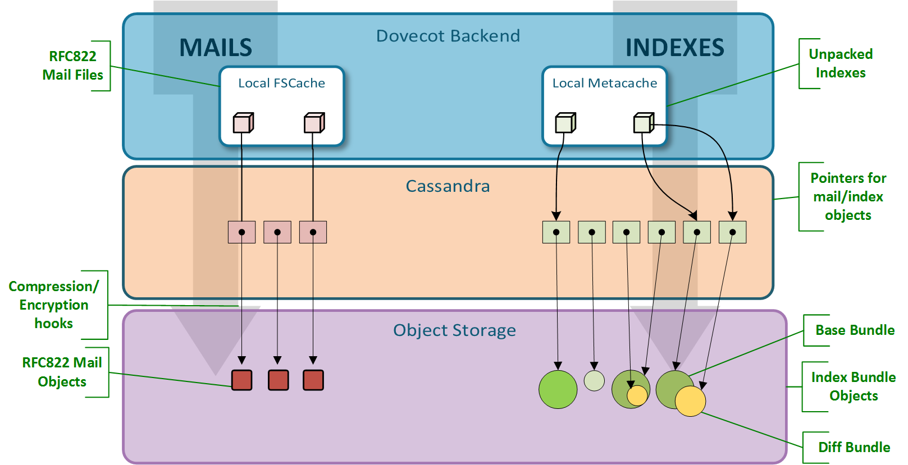

.. _obox_format_design:

==================
obox format design
==================

Dovecot obox format is split into two main categories: mail object handling and index object handling.

Mail Objects
=============
The mail object handling is easy enough: Each mail is stored in its own separate object. The object name is a uniquely generated name, which we call object ID (OID).

The mails are also cached locally using a fscache wrapper, which uses a global cache directory with a configurable max size, local to the backend. 
If the object storage access is fast, this cache doesn't need to be very large, but it should still exist. A small cache that usually stays in memory (tmpfs) is likely good (e.g. 1-2 GB).

The mail object names look like: 

user-hash/user@domain/mailboxes/folder-guid/oid

For example:

.. code-block:: none

   b5/899/user@example.com/mailboxes/00d7d12ea08a3153175e0000dfbea952/d88ff1001d4bf753a1b800001accfe22

Index Objects
==============
Dovecot obox format uses the normal Dovecot index file formats, except they are packed into index bundles when they are stored to object storage. The indexes are written lazily to the object storage in order to minimize the object storage I/O. Before writing the indexes to object storage they are cached on the backend in metacache where the index tree structure is unbundled as in traditional Dovecot index structure. Metacache is local to the backend.

There are two types of index bundles: base bundles and diff bundles. The base bundles may be large and they are updated somewhat rarely. The diff bundles contain the latest changes since the base bundle and are the ones usually updated.

This is done to avoid constantly uploading large index objects even though very little had changed. All objects are created with unique object names. 
This guarantees that two servers can't accidentally overwrite each others' changes. Instead, what happens is that there may be two conflicting index bundle objects. If Dovecot notices such conflict, it merges the conflicting indexes using dsync algorithm without data loss. 

This allows active-active multi-site setups to run safely during a split brain.

The base index object names look like: 

user-hash/user@domain/mailboxes/folder-guid/idx/bundle.timestamp-secs.timestamp-usecs.unique-id

For example:

.. code-block:: none

   b5/899/user@example.com/mailboxes/00d7d12ea08a3153175e0000dfbea952/idx/bundle.53f74dc2.0fbcf.c96d802b5d4df75307bb00001accfe22

The diff index object names look the same, except another "-unique-id" is appended after the base bundle name.
