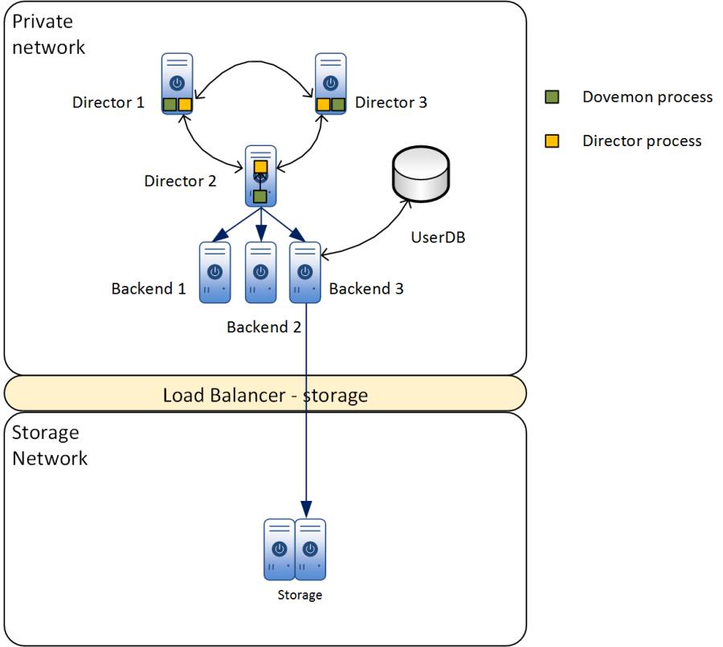

.. _dovemon:

=======
Dovemon
=======

When running a Dovecot director ring, it is vital to keep track of status of
backends and remove them from the directors if they are not reachable and add
them back when they come back online. Dovemon is a daemon that monitors status
of backends and can act automatically based on what it sees from the health
checks so that the administrator does not need to manually monitor the
backends.

Dovemon is part of licensed Dovecot Pro and is therefore available only as part
of the Dovecot Pro.

Each director instance interacts with a separate dovemon daemon. In a typical
setup, dovemon can be used in two ways. In a more general situation, each
dovemon monitors all backends and can enable and disable all of them. In this
context, disabling a backend means setting it to "down" and enabling means
setting the backend to "up". Figure 1 illustrates such setup.

   Figure 1: Each dovemon instance monitor all backends

Alternatively, it is possible to assign certain backends to each dovemon in the
configuration file. In this case, if a backend is down by the relevant dovemon,
other directors will find out in the next ring synchronization.

   Figure 2: Different backends assigned to each dovemon process

As shown in the above figures, each dovemon process interacts with a
separate director and notifies it if backends need to go down or up. At each
cycle of operation, dovemon polls the director for a list of all backends and
performs a set of tests for each backend in a separate thread. By default, this
cycle period is 10 seconds. These tests vary from simple connection check to
more complicated protocol level scenarios such as LMTP mail delivery, IMAP &
POP3 delete, IMAP expunge, etc. Each of these tests can be enabled or disabled
in the config file. By default, dovemon only performs a simple IMAP connection
and issues a LIST command.

If a certain number of test rounds fail consecutively (default is 3), dovemon
performs a series of "rapid" tests which means that it launches the tests again
but without any delays in between each round. The default value for number of
rapid test rounds is 10. At this stage, if a configurable amount of the tests
fail (default=7) the backend is deemed as faulty and it is removed from the
list of active backends. This is done by setting the backend as "down" in the
director process. Dovemon will continue polling the backend (if not disabled by
another dovemon) with tests configuration according to the YAML file and set it
to "up" again as soon as the first round of tests succeed.

At each cycle, dovemon waits for a configurable time (default is 3 seconds) to
receive a reply from backend. In case the reply times out, doveadm adds another
timeout period for the next round of polling. This is repeated until the max
retries have been performed. In the default case where where 3 retries are
performed with timeout set to 3s, dovemon waits for 3s, 6s, and 9s for first,
second, and third polling results respectively. However, this does not affect
the interval between polls i.e. start time of each polling is always at 10s
interval (in default case).

During all of the time dovemon inspects the backends, it keeps track of latency
of each backend. However, this information is not used for decision making and
are only written to logs.

Init scripts for Debian and Redhat systems are provided in binary packages in
form of Systemd unit files but they need to be enabled manually. By default
they are disabled.

In order to avoid a situation where dovemon instances over-rule each other's
decision on a host status each dovemon will bring back up a backend only if it
was disabled by itself (i.e. if dovemon finds out from its director that a
backend is down it will not try to bring it back up).

.. versionchanged:: v2.3.17 Python version required by Dovemon changed from 2 to 3.

.. _dovemon_configuration:

Configuration
-------------

Configuration of dovemon is done via modifying a YAML file. The python script
has an internal list of default configuration options. If any of these default
settings are present in the config file and the value is modified, the modified
value is used. Unknown configurations in the file are ignored. The binary
packages (rpm and deb) include an example config file.

Upon receiving SIGHUP, dovemon reads the YAML file again and reloads the
configurations.

Configuration file: ``/etc/dovecot/dovemon.config.yml``

.. code-block:: none

   loglevel: 4
   syslog_facility: 'local5'
   director_admin_socket: /var/run/dovecot/director-admin
   lockfile: /var/lock/subsys/dovemon
   auth: plain
   poll_imap: yes
   poll_pop3: no
   poll_lmtp: no
   imap_ssl: no
   pop3_ssl: no
   lmtp_ssl: no
   interval: 10
   timeout: 3
   retry_count: 3

Test accounts file: ``/etc/dovecot/dovemon.testaccounts.yml``

.. code-block:: none

   10.2.2.75:
   username: user0001
   password: tosivaikeasalasana
   10.2.2.76:
   username: user0002
   password: tosivaikeasalasana

For master user authentication, the ``auth`` setting in ``dovemon.yml`` should
be set to ``sasl``. Test accounts file:

.. code-block:: none

   10.2.2.75:
   username: user0001
   masteruser: masteruser
   password: masterpassword

This file allows configuring a separate test account for each backend. The
backend must be specified using the same IP address as what
``doveadm director status`` shows for it.

If connection to backends fail 3 times in a row per protocol (``retry_count``
in config) dovemon goes to rapid poll mode for the backend. In this rapid mode
dovecot does quick round of 10 polls with the same protocol (``rapid_rounds``
in config) and if 7 of them still fail, then issue ``HOST-DOWN`` in the backend
and ``FLUSH`` users form the backend to be redistributed to the remainining
backends.

Also dovemon issues ``HOST-UP`` on backend upon first successful poll if
backend is already marked down.

.. _dovemon_logging:

Logging
-------

At each phase of its operation i.e. at connection step, authentication step,
logout, etc, dovemon writes corresponding logs to syslog. Moreover, if dovemon
receives a SIGHUP it will write results of the last 10 polls to syslog. Latency
information detected from these polls is also included in the information
written to logs.

.. _dovemon_return_codes:

Return codes
------------

.. code-block:: none

  0: SIGTERM received, exited normally
  -1: Dovemon was unable to lock the pid file, already exists
  1: Dovemon was unable to lock the pid file, for any other reason
  2: Dovemon was unable to write default configuration to disk
  3: Configuration file exists but Dovemon was unable to read the file
  4: Configuration file path not set and "--write-missing-config" is not used

.. _dovemon_boolean:

Booleans in Dovemon
-------------------

In dovemon configuration file, following boolean values are accepted:

.. code-block:: none

  True, true, yes
  False, false, no

.. _dovemon_configs:

Dovemon configuration options
-----------------------------

.. _setting-dovemon_loglevel:

``loglevel``
---------------------------

- Default: ``4``
- Values: ``0, 1, 2, 4``

Logging level. Following levels and their corresponding meaning are available:

.. code-block:: none

  0: Info
  1: Warning
  2: Error
  4: Debug (any value greater than 2 will be treated as debug as well)

.. _setting-dovemon_debug:

``debug``
---------------------------

- Default: ``False``
- Values: :ref:`dovemon_boolean`

Start dovemon in debug mode. In debug mode dovemon doesn't fork to
background and prints log messages be stdout.

.. _setting-dovemon_lockfile:

``lockfile``
---------------------------

- Default: ``/var/lock/subsys/dovemon``

Location of local dovemon lock file.

.. _setting-dovemon_director_admin_socket:

``director_admin_socket``
---------------------------

- Default: ``/var/run/dovecot/director-admin``

director-admin unix socket used for director admin communication.
director-admin unix listener service needs to be configured in dovecot.conf

.. _setting-dovemon_logger_socket_addr:

``logger_socket_addr``
---------------------------

- Default: ``/dev/log``

Path to syslog socket.

.. _setting-dovemon_syslog_facility:

``syslog_facility``
---------------------------

- Default: ``mail``

Syslog facility to use when logging.

.. _setting-dovemon_auth:

``auth``
---------------------------

- Default: ``plain``
- Values:  ``plain, sasl``

Authentication method to use when connecting to Dovecot services.
``sasl`` is needed for master authentication.

.. _setting-dovemon_interval:

``interval``
---------------------------

- Default: ``10``

Time interval in seconds at which dovemon polls backends.

.. _setting-dovemon_timeout:

``timeout``
---------------------------

- Default: ``3``

Timeout value in seconds for each normal poll round. If at any stage in the poll
request timed out, the whole round is marked as failed.

.. _setting-dovemon_retry_count:

``retry_count``
---------------------------

- Default: ``3``

Number of failed rounds needed for a backend to be considered potentially down.
After this many failed rounds, dovemon will perform the rapid round on
the backend.

.. _setting-dovemon_rapid_rounds:

``rapid_rounds``
---------------------------

- Default: ``10``

Number of rapid polls performed.

Setting ``rapid_rounds`` to ``0`` disables the rapid round stage and dovemon
will issue ``HOST-DOWN`` on the backend right after ``retry_count`` number of
failed polls.

.. _setting-dovemon_rapid_fails_needed:

``rapid_fails_needed``
---------------------------

- Default: ``7``

Number of failed rapid polls required in order to mark backend down. If backend
still fails the rapid round checks, a ``HOST-DOWN`` command will be issued for
the backend.

.. _setting-dovemon_rapidpoll_timeout:

``rapidpoll_timeout``
---------------------------

- Default: ``2``

Timeout value in seconds for the rapid round operations. If at any
stage in the rapid round timeout happens, the whole rapid round is deemed
failed and backend is marked as down.

.. _setting-dovemon_poll_imap:

``poll_imap``
---------------------------

- Default: ``True``
- Values: :ref:`dovemon_boolean`

Use IMAP connection to poll backend.

.. _setting-dovemon_imap_ssl:

``imap_ssl``
---------------------------

- Default: ``False``
- Values: :ref:`dovemon_boolean`

IMAP connection to backend is encrypted.
(applicable when :ref:`setting-dovemon_poll_imap` is enabled)

.. _setting-dovemon_imap_port:

``imap_port``
---------------------------

- Default: ``143``

Port used for IMAP connection.
(applicable when :ref:`setting-dovemon_poll_imap` is enabled)

.. _setting-dovemon_imaps_port:

``imaps_port``
---------------------------

- Default: ``993``

Port used for encrypted IMAP connection.
(applicable when :ref:`setting-dovemon_poll_imap` is enabled)

.. _setting-dovemon_poll_imap_list:

``poll_imap_list``
---------------------------

- Default: ``True``
- Values: :ref:`dovemon_boolean`

Perform IMAP list check in polls. If enabled, dovemon performs an IMAP ``LIST``
command on the top-level mail folder and checks command success/failure.
(applicable when :ref:`setting-dovemon_poll_imap` is enabled)

.. _setting-dovemon_poll_imap_select:

``poll_imap_select``
---------------------------

- Default: ``False``
- Values: :ref:`dovemon_boolean`

Perform IMAP select check in polls. If enabled, inbox folder is selected and
command success/failure is checked.
(applicable when :ref:`setting-dovemon_poll_imap` is enabled)

.. _setting-dovemon_poll_imap_append:

``poll_imap_append``
---------------------------

- Default: ``False``
- Values: :ref:`dovemon_boolean`

Perform IMAP append check in polls. If enabled, a test message containing
``INTERNALDATE`` representation of timestamp (at time of append) will be
appended to inbox.
(applicable when :ref:`setting-dovemon_poll_imap` is enabled)

.. Warning:: Enabling this option without expunging messages can consume
             all of disk space over time. It is strongly recommended to enable
             :ref:`setting-dovemon_poll_imap_expunge` along with this option.

.. _setting-dovemon_poll_imap_expunge:

``poll_imap_expunge``
---------------------------

- Default: ``False``
- Values: :ref:`dovemon_boolean`

Perform IMAP expunge check in polls. If enabled, all messages in inbox are
flagged ``\Deleted`` and expunged. This option implicitly enables
:ref:`setting-dovemon_poll_imap_select`.
(applicable when :ref:`setting-dovemon_poll_imap` is enabled)

.. _setting-dovemon_poll_pop3:

``poll_pop3``
---------------------------

- Default: ``False``
- Values: :ref:`dovemon_boolean`

Use POP3 connection to poll backend.

.. _setting-dovemon_pop3_ssl:

``pop3_ssl``
---------------------------

- Default: ``False``
- Values: :ref:`dovemon_boolean`

POP3 connection to backend is encrypted.
(applicable when :ref:`setting-dovemon_poll_pop3` is enabled)

.. _setting-dovemon_pop3_port:

``pop3_port``
---------------------------

- Default: ``110``

Port used for POP3 connection.
(applicable when :ref:`setting-dovemon_poll_pop3` is enabled)

.. _setting-dovemon_pop3s_port:

``pop3s_port``
---------------------------

- Default: ``995``

Port used for encrypted POP3 connection.
(applicable when :ref:`setting-dovemon_poll_pop3` is enabled)

.. _setting-dovemon_poll_pop3_stat:

``poll_pop3_stat``
---------------------------

- Default: ``False``
- Values: :ref:`dovemon_boolean`

Perform POP3 stat check in polls. If enabled, a ``STAT`` command is performed
and command success/failure is checked.
(applicable when :ref:`setting-dovemon_poll_pop3` is enabled)

.. _setting-dovemon_poll_pop3_delete:

``poll_pop3_delete``
---------------------------

- Default: ``False``
- Values: :ref:`dovemon_boolean`

Perform POP3 delete check in polls. If enabled, all messages in ``STAT`` command
response will be deleted. This option implicitly enables
:ref:`setting-dovemon_poll_pop3_stat`.
(applicable when :ref:`setting-dovemon_poll_pop3` is enabled)

.. _setting-dovemon_poll_lmtp:

``poll_lmtp``
---------------------------

- Default: ``False``
- Values: :ref:`dovemon_boolean`

Use LMTP connection to poll backend.

.. _setting-dovemon_lmtp_ssl:

``lmtp_ssl``
---------------------------

- Default: ``False``
- Values: :ref:`dovemon_boolean`

LMTP connection to backend is encrypted.
(applicable when :ref:`setting-dovemon_poll_lmtp` is enabled)

.. _setting-dovemon_lmtp_port:

``lmtp_port``
---------------------------

- Default: ``24``

Port used for LMTP connection.
(applicable when :ref:`setting-dovemon_poll_lmtp` is enabled)

.. _setting-dovemon_poll_lmtp_deliver:

``poll_lmtp_deliver``
---------------------------

- Default: ``False``
- Values: :ref:`dovemon_boolean`

Include LMTP deliver check in polls. If enabled, a test message is delivered
on LMTP (using a series of ``LHLO``, ``MAIL``, ``RCPT``, ``DATA`` commands)
and command responses are checked.
(applicable when :ref:`setting-dovemon_poll_lmtp` is enabled)

.. Warning:: Enabling this option without expunging messages can consume
             all of disk space over time. It is strongly recommended to enable
             :ref:`setting-dovemon_poll_imap_expunge` along with this option.

.. _setting-dovemon_poll_unknown_backends:

``poll_unknown_backends``
---------------------------

- Default: ``True``
- Values: :ref:`dovemon_boolean`

Poll those hosts not listed in accounts file but are present in list of
backends returned by director (i.e. response to ``HOST-LIST``).

.. _setting-dovemon_use_host_flush:

``use_host_flush``
---------------------------

- Default: ``False``
- Values: :ref:`dovemon_boolean`

Issue a ``HOST-FLUSH`` after marking backend down with ``HOST-DOWN``. If set
to false, dovemon issues ``HOST-RESET-USERS`` for the host.

.. _setting-dovemon_use_delayed_down:

``use_delayed_down``
---------------------------

- Default: ``False``
- Values: :ref:`dovemon_boolean`

.. _setting-dovemon_delayed_down_delay:

``delayed_down_delay``
---------------------------

- Default: ``120``

.. _setting-dovemon_delayed_down_limit:

``delayed_down_limit``
---------------------------

- Default: ``2``

This group of settings configure dovemon to delay marking backends as down.

When enabled, if dovemon detects that a backend is down it puts the backend
into down-queue instead of marking it down immediately. Then after duration
specified by :ref:`setting-dovemon_delayed_down_delay` (in seconds) it will
perform a check: if number of backends queued down and number of backends
already down is more than :ref:`setting-dovemon_delayed_down_limit` then only
log backend failure. Otherwise, marks backend down.

.. versionadded:: v2.3.9.2

.. _setting-dovemon_beupdatescript:

``beupdatescript``
---------------------------

- Default: <empty>

Path to an executable backend update script. If set, on either of events a
backend is marked down or brought back up again, this script is called with
following arguments:

.. code-block:: none

  $/path/to/beupdatescript down/up hostname

