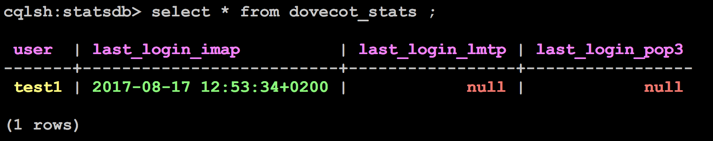
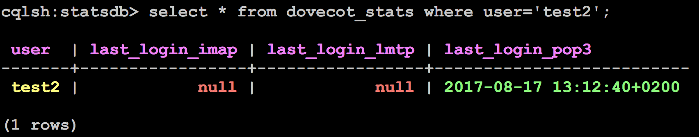
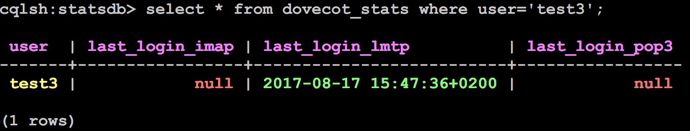
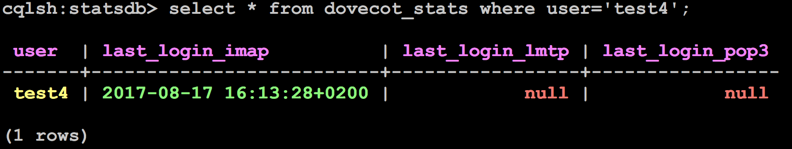
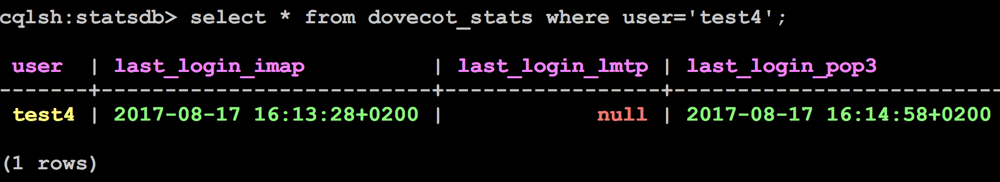
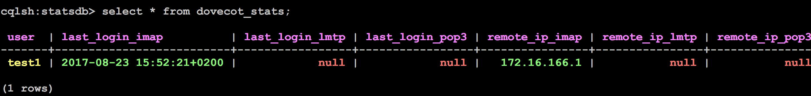
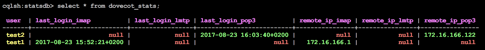

.. _last_login_plugin:

========================
Last Login plugin
========================

1. Dovecot Last Login Overview
^^^^^^^^^^^^^^^^^^^^^^^^^^^^^^^^
   Last login information is useful for trouble shooting scenarios, which usually starts with end user contacting customer care agent that the mailbox is unreachable or empty. Amongst the first things is to check when the customer last successfully did login to the mailbox and using which protocol as this might indicate that there might be some device with POP3 configured thus emptying the mailbox. Last login feature is designed for this use case, to allow easy way to search per any account the timestamp of last login or last mail delivery to the mailbox.

2. Last Login information from logs
^^^^^^^^^^^^^^^^^^^^^^^^^^^^^^^^^^^^^
   Last login can also be logged and these logs can be stored, rotated and then deleted. Finding out any particular account login means going through multiple log files per node multiplied by the number of nodes.

3. Last Login information to Cassandra
^^^^^^^^^^^^^^^^^^^^^^^^^^^^^^^^^^^^^^^^^
   Last Login feature is using Cassandra key value store to store the information where it can be searched per mailbox thus having fast response and only requiring small storage space compared to storing logs long enough to find the information from searching the multiple logs from multiple back ends.

4. Dovecot Last Login Feature
^^^^^^^^^^^^^^^^^^^^^^^^^^^^^^^^^^^^
   Dovecot uses last_login plugin to record on every access or LMTP delivery the timestamp and account ID to defined Cassandra storage cluster. Typically the configuration has separate fields for IMAP, POP, LMTP and webmail. Separating out webmail from normal IMAP access can be done based on the configuration of the webmail access to Dovecot.

Searching Cassandra per Account
^^^^^^^^^^^^^^^^^^^^^^^^^^^^^^^^^^^^
   Cassandra can be queried using CQL queries which are similar to SQL queries. The Actual query used for searching Last Login per Account will be provided as part of the delivery of the Last Login feature.

6. Integration to customer internal systems
^^^^^^^^^^^^^^^^^^^^^^^^^^^^^^^^^^^^^^^^^^^^^
   Integrations to search the Last Login from Cassandra can be done using the provided CQL query.

   Integration to customer’s internal support systems, such as used by customer care agents, are not included in the Last Login Feature, but are customer’s responsibility.

.. _7.configuration_needed_for_the_last_login_plugin_(General Setup):

7. Configuration needed for the last login plugin (General Setup)
^^^^^^^^^^^^^^^^^^^^^^^^^^^^^^^^^^^^^^^^^^^^^^^^^^^^^^^^^^^^^^^^^^^
The following configuration is needed to have the Dovecot last login plugin installed and working. This config has been validated and tested,

7.1 The test environment
=========================

The test environment is made of a basic Dovecot PRO installation on a BE node + 1 standalone node for Cassandra.

7.2 Dovecot packages
=========================
This is the minimal list of packages to installa on the BE node to have the last login plugin feature available:

* dovecot-ee-2.2.31.2-1.x86_64
* dovecot-ee-cassandra-plugin-2.2.31.2-1.x86_64

.. NOTE:: At the time this article was written, the 2.2.31.2-1 was the latest available release, please consider this just like a placeholder from now onwards.

7.3 Dovecot userdb
===================

.. NOTE:: For the sole purpose of testing a local passwd-file in /etc/dovecot/users with the content below has been used.

This is part of the overall dovecot configuration, with these lines:

.. code-block:: none

   userdb {
   args = username_format=%u /etc/dovecot/users
   driver = passwd-file
   }

Where the file /etc/dovecot/users is:

.. code-block:: none

   test1:{PLAIN}test1::::::userdb_last_login_key=last-login/%s/%u
   test2:{PLAIN}test2::::::userdb_last_login_key=last-login/%s/%u
   test3:{PLAIN}test3::::::userdb_last_login_key=last-login/%s/%u
   test4:{PLAIN}test4::::::userdb_last_login_key=last-login/%s/%u

Based on the specific test, the above config has been changed as explained below.

7.4 Dovecot BE configuration
=============================
The following is the configuration to be added to the file `/etc/dovecot/dovecot.conf` to have the last login plugin working properly:

.. code-block:: none

   plugin {
   last_login_dict = proxy:dict-async:statsdb
   last_login_key = last-login/%s/%u
   last_login_precision = ms
   }
   protocol imap {
   mail_plugins = " last_login"
   }
   protocol pop3 {
   mail_plugins = " last_login"
   }
   protocol lmtp {
   mail_plugins = " last_login"
   }
   dict {
   statsdb = cassandra:/etc/dovecot/statsdb-dict-cql.conf.ext
   }

Where the file `/etc/dovecot/statsdb-dict-cql.conf.ext` is, in general:

.. code-block:: none

   connect = host=x.x.x.x host=y.y.y.y host=z.z.z.z dbname=statsdb
   map {
   pattern = shared/last-login/imap/$user
   table = dovecot_stats
   value_field = last_login_imap
   value_type = string
   fields {
   user = $user
   }
   }
   map {
   pattern = shared/last-login/pop3/$user
   table = dovecot_stats
   value_field = last_login_pop3
   value_type = string
   fields {
   user = $user
   }
   }
   map {
   pattern = shared/last-login/lmtp/$user
   table = dovecot_stats
   value_field = last_login_lmtp
   value_type = string
   fields {
   user = $user
   }
   }

.. NOTE:: x.x.x.x, y.y.y.y, z.z.z.z are the IP addresses of the Cassandra nodes where the statsdb is installed. Add more IPs, if you have more nodes.

For the tests, the Cassandra statsdb is running only on one node with `IP=172.16.166.121`, so the file used is:

.. code-block:: none

   connect = host=172.16.166.121 dbname=statsdb
   map {
   pattern = shared/last-login/imap/$user
   table = dovecot_stats
   value_field = last_login_imap
   value_type = string
   fields {
   user = $user
   }
   }
   map {
   pattern = shared/last-login/pop3/$user
   table = dovecot_stats
   value_field = last_login_pop3
   value_type = string
   fields {
   user = $user
   }
   }
   map {
   pattern = shared/last-login/lmtp/$user
   table = dovecot_stats
   value_field = last_login_lmtp
   value_type = string
   fields {
   user = $user
   }
   }

Find below the output of the command doveconf -n taken on the BE node, including the above mentioned config plus all the remaining one.

.. code-block:: none

   # 2.2.31.2 (f6ed5ab): /etc/dovecot/dovecot.conf
   # OS: Linux 3.10.0-514.26.2.el7.x86_64 x86_64 CentOS Linux release 7.3.1611 (Core) xfs
   auth_debug = yes
   auth_mechanisms = plain login
   auth_verbose = yes
   dict {
   statsdb = cassandra:/etc/dovecot/statsdb-dict-cql.conf.ext
   }
   disable_plaintext_auth = no
   mail_debug = yes
   mail_fsync = never
   mail_gid = vmail
   mail_location = maildir:/var/home/%u/Maildir
   mail_prefetch_count = 10
   mail_uid = vmail
   mailbox_list_index = yes
   namespace inbox {
   inbox = yes
   location =
   mailbox Drafts {
   auto = create
   special_use = \Drafts
   }
   mailbox Junk {
   auto = create
   special_use = \Junk
   }
   mailbox Sent {
   auto = create
   special_use = \Sent
   }
   mailbox Trash {
   auto = create
   special_use = \Trash
   }
   prefix =
   separator = /
   }
   passdb {
   args = nopassword=y
   driver = static
   }
   plugin {
   last_login_dict = proxy:dict-async:statsdb
   last_login_key = last-login/%s/%u/%r
   last_login_precision = ms
   }
   pop3_no_flag_updates = yes
   pop3_uidl_format = %g
   postmaster_address = postmaster@mydomain.com
   service auth {
   client_limit = 256000
   unix_listener auth-master {
   user = vmail
   }
   unix_listener auth-userdb {
   user = vmail
   }
   }
   service dict-async {
   unix_listener dict-async {
   group = vmail
   mode = 0660
   user = vmail
   }
   }
   service lmtp {
   inet_listener lmtp {
   address = *
   port = 24
   }
   }
   ssl = no
   userdb {
   args = username_format=%u /etc/dovecot/users
   driver = passwd-file
   }
   verbose_proctitle = yes
   protocol imap {
   mail_plugins = " last_login"
   }
   protocol pop3 {
   mail_plugins = " last_login"
   }
   protocol lmtp {
   mail_plugins = " last_login"
   }
   protocol doveadm {
   passdb {
   args = nopassword=y
   driver = static
   name =
   }
   }

7.5 Cassandra configuration
============================
Connect to the node where you have installed Cassandra and, after starting it:

   Create the keyspace statsdb 

.. code-block:: none

   create keyspace if not exists statsdb WITH REPLICATION = { 'class' : 'SimpleStrategy', 'replication_factor' : 1 };

..NOTE:: in this setup we have supposed to have 1 single DC and 1 node in it, that's why SimpleStrategy and replication_factor=1 have been used. In more complex Cassandra setup you might want to change them according to your needs.

.. code-block:: none

   Create the table dovecot_stats
   use statsdb;
   create table if not exists dovecot_stats (
   user text,
   last_login_imap timestamp,
   last_login_pop3 timestamp,
   last_login_lmtp timestamp,
   primary key (user)
   );

8. Examples
^^^^^^^^^^^^^
The goal of this session is to show how the plugin works in different test scenarios: imap, pop3, etc...

8.1 Example 1: IMAP last login
===============================
In this example the user test1 will simply login using IMAP:

.. code-block:: none

   [root@dovebe01 ~]# telnet 127.0.0.1 143
   Trying 127.0.0.1...
   Connected to 127.0.0.1.
   Escape character is '^]'.
   * OK [CAPABILITY IMAP4rev1 LITERAL+ SASL-IR LOGIN-REFERRALS ID ENABLE IDLE AUTH=PLAIN AUTH=LOGIN] Dovecot ready.
   a login test1 test1
   a OK [CAPABILITY IMAP4rev1 LITERAL+ SASL-IR LOGIN-REFERRALS ID ENABLE IDLE SORT SORT=DISPLAY THREAD=REFERENCES THREAD=REFS THREAD=ORDEREDSUBJECT MULTIAPPEND URL-PARTIAL CATENATE UNSELECT CHILDREN NAMESPACE UIDPLUS LIST-EXTENDED I18NLEVEL=1 CONDSTORE QRESYNC ESEARCH ESORT SEARCHRES WITHIN CONTEXT=SEARCH LIST-STATUS BINARY MOVE NOTIFY] Logged in
   * BYE Internal error occurred. Refer to server log for more information.
   Connection closed by foreign host.

From the dovecot maillog is interesting to note that:

.. code-block:: none

   Aug 17 12:53:34 dovebe01 dovecot: imap(test1): Debug: Loading modules from directory: /usr/lib64/dovecot
   Aug 17 12:53:34 dovebe01 dovecot: imap(test1): Debug: Module loaded: /usr/lib64/dovecot/lib10_last_login_plugin.so
   Aug 17 12:53:34 dovebe01 dovecot: imap(test1): Debug: Added userdb setting: plugin/last_login_key=last-login/imap/test1

On Cassandra node we can verify that this IMAP login has been registered in the dovecot_stats table:

8.2 Example 2: POP3 last login
===============================
In this example we assume that the user test2 has performed a pop3 access to the system:

.. code-block:: none

   [root@dovebe01 ~]# telnet 127.0.0.1 110
   Trying 127.0.0.1...
   Connected to 127.0.0.1.
   Escape character is '^]'.
   +OK Dovecot ready.
   USER test2
   +OK
   PASS test2
   +OK Logged in.

From the dovecot maillog is interesting to note that:

.. code-block:: none

   Aug 17 13:12:40 dovebe01 dovecot: pop3(test2): Debug: Loading modules from directory: /usr/lib64/dovecot
   Aug 17 13:12:40 dovebe01 dovecot: pop3(test2): Debug: Module loaded: /usr/lib64/dovecot/lib10_last_login_plugin.so
   Aug 17 13:12:40 dovebe01 dovecot: pop3(test2): Debug: Added userdb setting: plugin/last_login_key=last-login/pop3/test2

On Cassandra node we can verify that this POP3 login has been registered in the dovecot_stats table:

8.3 Example 3: LMTP last login
===============================

In this example the user test1 sends an email to the user test3

.. code-block:: none

   [root@dovebe01 ~]# telnet 127.0.0.1 24
   Trying 127.0.0.1...
   Connected to 127.0.0.1.
   Escape character is '^]'.
   220 dovebe01 Dovecot ready.
   LHLO dovebe01
   250-dovebe01
   250-8BITMIME
   250-ENHANCEDSTATUSCODES
   250 PIPELINING
   MAIL FROM:<test1>
   250 2.1.0 OK
   RCPT TO:<test3>
   250 2.1.5 OK
   DATA
   354 OK
   Hello world
   .
   250 2.1.5 OK

From the dovecot maillog is interesting to note that:

.. code-block:: none

   Aug 17 15:45:43 dovebe01 dovecot: auth: Debug: userdb out: USER#0118#011test3#011last_login_key=last-login/lmtp/test3
   Aug 17 15:45:43 dovebe01 dovecot: lmtp(2590): user-lookup(test3)Debug: auth USER input: test3 last_login_key=last-login/lmtp/test3
   Aug 17 15:45:43 dovebe01 dovecot: lmtp(2590): user-lookup(test3)Debug: Added userdb setting: plugin/last_login_key=last-login/lmtp/test3

On Cassandra node we can verify that this LMTP login has been registered in the dovecot_stats table:

8.4 Example 4: IMAP login followed by POP3 last login
======================================================

.. code-block:: none

To simulate this scenario, let's assume that at the beginning the user did an IMAP login and later a POP3 one.

If we check in Cassandra, we can find the record below immediately after the IMAP login:

Now let's assume that the user is reconnecting via POP3, if we check in Cassandra, we can find the record below:

As you can easily see, there is always one record and the IMAP login time has not changed, whilst the POP3 login has been added to the same raw.

9. Appendix A - Tracking last login and IP address
^^^^^^^^^^^^^^^^^^^^^^^^^^^^^^^^^^^^^^^^^^^^^^^^^^^^
In addition to the last login information collected already via the setup shown in the previous chapters, the operator might also want to associate this information with the IP address of the client to better track network activity and facilitate troubleshooting in case of issues.

Please modify the "General Setup" :ref:`7.configuration_needed_for_the_last_login_plugin_(General Setup)`. in this way to achieve the goal of tracking last login + IP (client source IP)

9.1 Dovecot userdb 
=====================
Modify the file /etc/dovecot/users from:

.. code-block:: none

   test1:{PLAIN}test1::::::userdb_last_login_key=last-login/%s/%u
   test2:{PLAIN}test2::::::userdb_last_login_key=last-login/%s/%u
   test3:{PLAIN}test3::::::userdb_last_login_key=last-login/%s/%u
   test4:{PLAIN}test4::::::userdb_last_login_key=last-login/%s/%u
   to

   test1:{PLAIN}test1::::::userdb_last_login_key=last-login/%s/%u/%r
   test2:{PLAIN}test2::::::userdb_last_login_key=last-login/%s/%u/%r
   test3:{PLAIN}test3::::::userdb_last_login_key=last-login/%s/%u/%r
   test4:{PLAIN}test4::::::userdb_last_login_key=last-login/%s/%u/%r

.. NOTE:: The additional variable %r is containing the IP address of the client.

9.2 Dovecot BE configuration 
=============================
In the file `/etc/dovecot/dovecot.conf` modify the plugin section for the `last_login_key` from:

.. code-block:: none

   plugin {
   last_login_dict = proxy:dict-async:statsdb
   last_login_key = last-login/%s/%u
   last_login_precision = ms
   }
   to

   plugin {
   last_login_dict = proxy:dict-async:statsdb
   last_login_key = last-login/%s/%u/%r
   last_login_precision = ms
   }

The new file `/etc/dovecot/statsdb-dict-cql.conf.ext` to map variable to Cassandra database is now:

.. code-block:: none

   connect = host=172.16.166.121 dbname=statsdb
   map {
   pattern = shared/last-login/imap/$user/$r
   table = dovecot_stats
   value_field = last_login_imap
   value_type = string
   fields {
   user = $user
   remote_ip_imap = $r
   }
   }
   map {
   pattern = shared/last-login/pop3/$user/$r
   table = dovecot_stats
   value_field = last_login_pop3
   value_type = string
   fields {
   user = $user
   remote_ip_pop3= $r
   }
   }
   map {
   pattern = shared/last-login/lmtp/$user/$r
   table = dovecot_stats
   value_field = last_login_lmtp
   value_type = string
   fields {
   user = $user
   remote_ip_lmtp= $r
   }
   }

9.3 Cassandra configuration
============================
Drop the previous dovecot_stats table and create it again in the keyspace statsdb as shown below:

.. code-block:: none

   create table if not exists dovecot_stats {
   user text,
   remote_ip_imap inet,
   remote_ip_pop3 inet,
   remote_ip_lmtp inet,
   last_login_imap timestamp,
   last_login_pop3 timestamp,
   last_login_lmtp timestamp,
   primary key (user)
   }

9.4 Clients configuration and IP addresses
===========================================
The following clients IP will be used for the tests:

.. code-block:: none

   172.16.166.1 for test1 IMAP client
   172.16.166.122 for test2 POP3 client

..NOTE:: only IMAP and POP3 tests will be shown below, for LMTP and other combinations tests can be derived from the general part.

9.4.1 IMAP login for test1
============================
From the Source IP 172.166.16.1:

.. code-block:: none

   telnet 172.16.166.141 143
   Trying 172.16.166.141...
   Connected to 172.16.166.141.
   Escape character is '^]'.
   * OK [CAPABILITY IMAP4rev1 LITERAL+ SASL-IR LOGIN-REFERRALS ID ENABLE IDLE AUTH=PLAIN AUTH=LOGIN] Dovecot ready.
   a login test1 test1
   a OK [CAPABILITY IMAP4rev1 LITERAL+ SASL-IR LOGIN-REFERRALS ID ENABLE IDLE SORT SORT=DISPLAY THREAD=REFERENCES THREAD=REFS THREAD=ORDEREDSUBJECT MULTIAPPEND URL-PARTIAL CATENATE UNSELECT CHILDREN NAMESPACE UIDPLUS LIST-EXTENDED I18NLEVEL=1 CONDSTORE QRESYNC ESEARCH ESORT SEARCHRES WITHIN CONTEXT=SEARCH LIST-STATUS BINARY MOVE NOTIFY] Logged in
   a logout
   * BYE Logging out
   a OK Logout completed (0.001 + 0.000 secs).
   Connection closed by foreign host.

From Cassandra you can easily verify that a record has been added containing the last login + source IP of the client for the IMAP protocol and for user test1:

9.4.2 POP3 login for test2
============================
From the Source IP 172.166.16.122:

.. code-block:: none

   telnet 172.16.166.141 110
   Trying 172.16.166.141...
   Connected to 172.16.166.141.
   Escape character is '^]'.
   +OK Dovecot ready.
   USER test2
   +OK
   PASS test2
   +OK Logged in.

From Cassandra you can easily verify that a record has been added containing the last login + source IP of the client for the POP3 protocol and for user test2:

