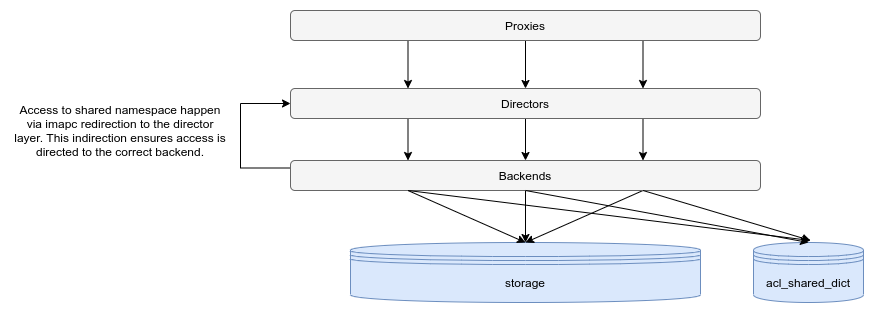

.. _mailbox_sharing_in_cluster:

===================================
Shared Mailboxes in Dovecot Cluster
===================================

.. note:: This setup is supported from Dovecot version 2.3.15 and higher only

As mentioned in :ref:`dovecot_cluster_architecture`, you can't have
multiple servers accessing the same user at the same time
or it will lead into trouble. This can become problematic with shared
mailboxes, because two users who are sharing a folder may run in
different servers. The solution here is to access the shared folders via
IMAP protocol, which passes through the Dovecot proxies so the
actual filesystem access is done only by one server.

There are some limitations for this kind of use case:

-  ``imapc_*`` settings are global. You can't have two different namespaces
   with different imapc settings yet.

-  The imapc code doesn't support some IMAP features. Most importantly
   SORT isn't supported, which may result in lower performance.

Setting up user-shared folders
------------------------------

You'll need to setup master user logins to work for all the users. The
logged in user becomes the master user. The master user doesn't actually
have any special privileges. It's just used to get ACLs applied correctly
using permissions of the master user (the logged in user). It is supported
to access shared mailboxes of users which live on other backends via the IMAP
protocol. For this purpose shared mailboxes in a cluster must be accessed via
another namespace which has ``location`` configured to use ``imapc``.

It is recommended to disable shared namespaces for master users so you should
add ``userdb_namespace/shared/disabled=yes`` to your master passdb as
:ref:`extra field <authentication-password_database_extra_fields>`. Depending on
the authentication configuration it may be necessary to also override the ``acl_user``
via :ref:`userdb extra field <authentication-password_database_extra_fields>`
like this ``userdb_acl_user=%{auth_user}``.

Mailboxes in the shared namespace can be accessed using the given namespace
prefix. For example the user ``someone1`` could have access to a
mailbox(``shared_mailbox``) owned by the user ``someone2``. To access mails
in this mailbox ``someone1`` would access a mailbox with the name
``shared/someone2/shared_mailbox``. The permissions which are given to
``someone1`` on this mailbox are determined by :ref:`acl`.

::

   namespace shared {
     type = shared
     prefix = shared/%%u/
     list = children
     subscriptions = no
     # Use INDEXPVT to enable per-user \Seen flags.
     # If running earlier versions than 2.3.15, or earlier than 2.3.17 with obox
     # storage INDEXPVT is not supported.
     location = imapc:~/shared/%%u:INDEXPVT=~/shared-pvt/%%u
   }

.. note:: Obox relies on having the INDEXPVT directory configured to ``~/shared-pvt``
          otherwise the private indexes are not tracked by metacache and can
          get lost if user changes backends.

.. note:: See :ref:`user_shared_mailboxes_vs` for an explanation more details on the used variables.

Additionally imapc must be configured accordingly on the backends:
 * On backends either passdb or userdb for non-master users must return
   ``userdb_imapc_master_user=%{user}`` or ``imapc_master_user=%{user}``
 * :dovecot_core:ref:`imapc_master_user` becomes set using userdb. In case of
   a simple setup ``imapc_master_user`` can also be just set to ``%u``
   (the logged in user).
 * :dovecot_core:ref:`imapc_password` must be set to the master password which
   is configured on all backends and proxies
 * :dovecot_core:ref:`imapc_host` must point to a load balancer's address that
   connects to Dovecot proxy

.. versionadded:: 2.3.15 INDEXPVT for imapc is supported from 2.3.15 onwards.
                  In general INDEXPVT with imapc is only supported for non-obox
                  storages.

.. versionchanged:: v2.4.0;v3.0.0 Some selected IMAPC features are auto-enabled
                    by default. Please refer to :dovecot_core:ref:`imapc_features`
                    for description on individual flags. Prior to this version
                    you must enable at least the following features:
                    ``fetch-bodystructure fetch-headers rfc822.size search modseq acl delay-login``

::

   imapc_host = proxy-load-balancer
   #imapc_user = # leave this empty. It'll be automatically filled with the destination username.
   imapc_password = master-secret
   # With v2.4.0;v3.0.0 the following features are enabled by default, prior to
   # this version the following must be uncommented:
   #imapc_features = fetch-bodystructure fetch-headers rfc822.size search modseq acl delay-login

As mentioned earlier the :ref:`acl <acl>` plugin must be loaded and configured
accordingly:

::

    mail_plugins = $mail_plugins acl

    plugin {
      acl = vfile
      # Added in 2.3.15
      acl_ignore_namespace = shared/*
      acl_shared_dict = $your_prefered_shared_dict
    }

    # In order to be able to issue ACL commands over imap, imap_acl must be loaded
    protocol imap {
      mail_plugins = $mail_plugins imap_acl
    }

The :ref:`acl <acl>` plugin must be told to ignore the shared namespace and all
its children using the :dovecot_plugin:ref:`acl_ignore_namespace` setting.

The shared dictionary needs to be accessible from all the backends. The
possibilities for it are:

-  file: A single shared file in filesystem. This becomes a performance
   bottleneck easily if there are many in a shared filesystem.

-  fs posix: Shared directory in filesystem. This will create many small
   files in a shared filesystem.

-  sql: Shared SQL server

-  Any other :ref:`shared dictionary <dict>` can be used like described at
   :ref:`user_shared_mailboxes_shared_mailbox_listing`.

Please also see :ref:`mailbox_sharing_in_cluster_simple_example`.

Shared folders and quota
------------------------

When using the :ref:`quota_plugin` it must be configured to not attempt to
calculate quota for the shared namespaces. This is suggested to be achieved by
limiting the quota plugin to the private inbox namespace using:

``quota=count:ns=<inbox namespace prefix>``

For more details on quota configuration please see :ref:`quota_configuration`.
