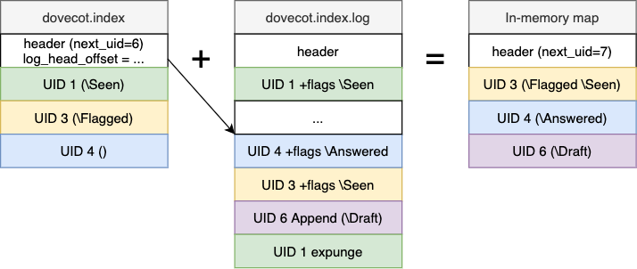

.. _mail_index_file_format:

======================
Mail index file format
======================

Mail index files consist of:

 * :ref:`Main index file <mail_index_format_main>` (``dovecot.index``)

 * :ref:`Transaction log <mail_index_format_log>` (``dovecot.index.log`` and ``dovecot.index.log.2``)

 * :ref:`Cache file <mail_index_format_cache>` (``dovecot.index.cache``)

See also :ref:`dovecot_mail_index_api`.

The mail index files are used in a few different places:

 * Mailbox indexes (``dovecot.index*``)
 * :ref:`mailbox_list_index` (``dovecot.list.index*``)
 * mdbox map index (``dovecot.map.index*``)

The mailbox index is optional for some mailbox formats (maildir, mbox), but
required required for all high performance mailbox formats (sdbox, mdbox, obox).

The index files were implemented to optimize Dovecot, so the file formats
attempt to be efficient. The index files are often mmap()ed into memory and
accessed directly via structs. This means that the data is stored using the
CPU endianess, and all structs that end up in index files have to be careful
with data alignment to avoid crashes with CPUs that require the alignment.

At times there have been thoughts about changing index handling so it wouldn't
care about CPU endianess or alignment, but this would be a huge change and
the end result would almost certainly be worse performance. This is mostly a
theoretical problem anyway: It's very unlikely that index files are moving
between little and big endian CPUs, and if that is actually wanted the mails
can be migrated with dsync.

Main index
----------

The main index contains fixed size records, which contain at least:

 * IMAP UID
 * Message flags (IMAP system flags)

There are also optional extensions, which increase the record size:

 * Message keywords (custom flags)
 * Offset to cache file
 * Message sorting optimization records
 * Mailbox format-specific extensions

The index file's header also contains some summary information, such as
how many messages exist, how many of them are unseen and how many are
marked with ``\Deleted`` flag. This allows efficiently answering the IMAP
STATUS commands.

The ``dovecot.index`` file is lazily updated by recreating it once in a while.
An existing ``dovecot.index`` file is never written to. The transaction log
file contains updates that need to be applied on top of the main index file to
get to the latest state of the mailbox.

See :ref:`mail_index_format_main` for more details.

Transaction log
---------------

Transaction log contains all the changes going to the main index (no
``dovecot.index.cache`` contents). It is the only file that is always
required to exist for a folder. (Newly created folder indexes don't contain
``dovecot.index`` immediately.)

New transactions are usually appended to the log file. Once the log becomes
large enough, it's rotated into ``dovecot.index.log.2`` and a new empty log
file is created. The ``.log.2`` file becomes deleted on the next log
rotation, or earlier if the ``.log.2`` becomes old enough.

There are several advantages to having a transaction log:

 * It provides atomic transactions: The transaction either succeeds, or it
   doesn't. For example if a transaction sets a flag to one message and
   removes it from another, it's guaranteed that both changes happen.

 * It allows another process to quickly see what changes have been made to
   the mailbox by other processes. For example IMAP protocol needs to send
   the IMAP client a list of all mailbox changes after each IMAP command.

    * This is also important when storing the index files in NFS or in a
      clustered filesystem. Instead of re-reading the whole index file after
      each external change, Dovecot can simply read the new changes from the
      transaction log and apply them to the in-memory copy of the main index.

 * They're also used for quickly getting changes (flag changes and expunges
   especially) since a specific point in time:

    * QRESYNC extension
    * doveadm sync (dsync) / replication

 * obox index merging works better using the transaction log.

See :ref:`mail_index_format_log` for more details.

Cache file
----------

The cache file can have all kinds of cached email data, such as cached
email headers. The cached data can't be changed. To prevent abuse,
excessively large cache records aren't added to the cache file.

Each mailbox can have its own different caching decisions. New cache fields
are dynamically added as they become used. For example a user may start
using a new IMAP client, which fetches some new message headers that old
clients didn't want. This triggers Dovecot to start caching the newly
requested header for any new mail deliveries. Similarly if some cache field
isn't accessed for a while, it's dropped entirely.

Fields can be cached either permanently or temporarily. The temporary fields
may be dropped for mails that were saved more than 7 days ago. The idea for
temporary fields is that some IMAP clients cache all the data locally, so
they benefit from Dovecot's caching only once. 7 days should be long enough
that the user has accessed the mailbox with all their locally caching clients.
After this the cache fields are just wasting disk space unnecessarily.

See :ref:`mail_index_format_cache` for more details.

.. _mailbox_list_index:

Mailbox list index
------------------

``dovecot.list.index*`` files are used for mailbox list indexes. It uses
the same mail index format, although some fields are slightly abused to
make it work.

 * The index header contains ID => name mapping. The name isn't the full
   mailbox name, but rather each hierarchy level has its own ID and name. For
   example a mailbox name "foo/bar" (with '/' as separator) would have
   separate IDs for "foo" and "bar" names.
 * The mail record's UID field contains is a semi-permanent identifier for
   the mailbox. The mailbox_list_index_record extension includes name_id and
   parent_uid fields, which allow building the whole mailbox tree.
   parent_uid=0 means root, otherwise it's the parent node's uid.
 * Message flags are used for list-specific flags (e.g. ``\NoSelect``).
 * The mailbox_list_index_record extension also contains GUID and UIDVALIDITY
   for selectable mailboxes. If a mailbox is recreated using the same name,
   its GUID also changes. Note however that the UID in ``dovecot.list.index``
   doesn't change, because the UID refers to the mailbox name, not to the
   mailbox itself.
 * The records may contain also extensions for allowing mailbox_get_status()
   to return values directly from the mailbox list index.
 * Storage backends may also add their own extensions to figure out if a
   record is up to date.

.. _locklessint:

Lockless integers
-----------------

Dovecot uses several different techniques to allow reading files without
locking them. One of them uses fields in a "lockless integer" format.
Initially these fields have "unset" value. They can be set to a wanted
value in range :math:`0..2^{28}` (with 32bit fields) once, but they cannot
be changed. It would be possible to set them back to "unset", but
setting them the second time isn't safe anymore, so Dovecot never does
this.

The lockless integers work by allocating one bit from each byte of the
value to "this value is set" flag. The reader then verifies that the
flag is set for the value's all bytes. If all of them aren't set, the
value is still "unset". Dovecot uses the highest bit for this flag. So
for example:

-  ``0x00000000``: The value is unset

-  ``0xFFFF7FFF``: The value is unset, because one of the bytes didn't have
   the highest bit set

-  ``0xFFFFFFFF``: The value is :math:`2^{28}-1`

-  ``0x80808080``: The value is ``0``

-  ``0x80808180``: The value is ``0x80``

Dovecot contains ``mail_index_uint32_to_offset()`` and
``mail_index_offset_to_uint32()`` functions to translate values between
integers and lockless integers. The "unset" value is returned as 0, so
it's not possible to differentiate between "unset" and "set" 0 values.
