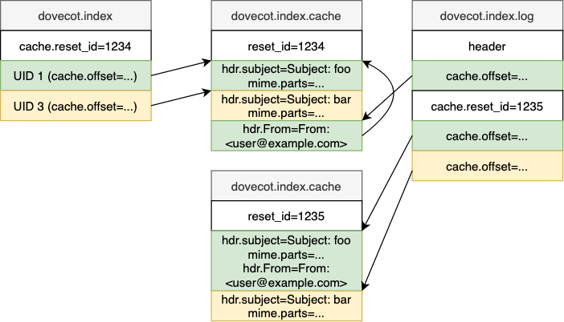

.. _mail_index_format_cache:

Mail index cache
================

See :ref:`mail_index_file_format` for an overview of what the cache does.

Client types
------------

IMAP clients can work in many different ways. There are basically 2
types:

#. Online clients that ask for the same information multiple times (e.g.
   webmails, Pine)

#. Offline clients that usually download first some of the interesting
   message headers and only after that the message bodies (possibly
   automatically, or possibly only when the user opens the mail). Most
   non-webmail IMAP clients behave like this.

Cache file is extremely helpful with the type 1 clients. The first time
that client requests message headers or some other metadata they're
stored into the cache file. The second time they ask for the same
information Dovecot can now get it quickly from the cache file instead
of opening the message and parsing the headers.

For type 2 clients the cache file is also somewhat helpful if client
fetches any initial metadata. Some of the information is helpful in any
case, for example it's required to know the message's virtual size when
downloading the message with IMAP. Without the virtual size being in cache
Dovecot first has to read the whole message first to calculate it, which
increases CPU usage.

Only the specified fields that client(s) have asked for earlier are
stored into cache file. This allows Dovecot to be adaptive to different
clients' needs and still not waste disk space (and cause extra disk
I/O!) for fields that client never needs. Although this behavior is
configurable with :dovecot_core:ref:`mail_cache_fields`,
:dovecot_core:ref:`mail_always_cache_fields`
and :dovecot_core:ref:`mail_never_cache_fields` settings.

Dovecot can cache fields either permanently or temporarily. Temporarily
cached fields are dropped from the cache file after about a week.
Dovecot uses two rules to determine when data should be cached
permanently instead of temporarily:

#. Client accessed messages in non-sequential order within this session.
   This most likely means it doesn't have a local cache.

#. Client accessed a message older than one week.

These rules might not always work optimally, so Dovecot also re-evaluates
the caching decisions once in a while:

 * When caching decision is YES (permanently cache the field), the field's
   last_used is updated only when the caching decision has been verified to
   be correct.

 * When caching decision is TEMP, the last_used is updated whenever the field
   is accessed.

 * When last_used becomes 30 days old (or
   :dovecot_core:ref:`mail_cache_unaccessed_field_drop`) a YES caching
   decision is changed to TEMP.

 * When last_used becomes 60 days old (or 2 *
   :dovecot_core:ref:`mail_cache_unaccessed_field_drop`) a TEMP caching
   decision is changed to NO.

File format
-----------

The cache file format is:

 * Base header (``struct mail_cache_header``).
 * List of ``struct mail_cache_header_fields`` or ``struct mail_cache_record``

After the base header it can't be assumed what the rest of the file contains.
Everything after it must be accessed via provided file offsets.

The list of cached fields exists in ``struct mail_cache_header_fields``.
The initial offset to it is in ``mail_cache_header.field_header_offset``.
The following updates are written to ``mail_cache_header_fields.next_offset``,
so the header reading must follow this linked list to the end.

The cache records (``struct mail_cache_record``) are accessed via offsets in
the "cache" extension of main index. The offset points to the newest cache
record that was written to the mail. There can be multiple "continuation
records", which can be accessed via ``mail_cache_record.prev_offset``. When
searching for a cache record for a mail, search through this whole linked list.
If a wanted field is found, it's not necessary to search for other instances
of it. If there are any other instances, they're just identical duplicates.

The cache record has a size describing its full size, followed by a list of
(field type, field specific data) until the cache record size is reached.

Cache file was designed to be storing only immutable data. The current
implementation doesn't support modifying existing data, although in theory
this could be possible. If this is really required, it's possible to drop
cache for a specific mail entirely and then re-add it.

See ``lib-index/mail-cache-private.h`` in the source code for details about
these structs.

Field types
-----------

Specified in ``enum mail_cache_field_type``:

 * ``MAIL_CACHE_FIELD_FIXED_SIZE``:
   Fixed size cache field. The size is specified only in the cache
   field header, not separately for each record.

 * ``MAIL_CACHE_FIELD_VARIABLE_SIZE``:
   Variable sized binary data.

 * ``MAIL_CACHE_FIELD_STRING``:
   Variable sized string. There is no difference internally to how
   ``MAIL_CACHE_FIELD_VARIABLE_SIZE`` is handled, but it helps at least
   ``doveadm dump`` to know whether to hex-encode the output.

 * ``MAIL_CACHE_FIELD_BITMASK``:
   A fixed size bitmask field. It's possible to add new bits by updating
   this field. All the added fields are ORed together.

 * ``MAIL_CACHE_FIELD_HEADER``:
   Variable sized message header. The data begins with a 0-terminated
   ``uint32_t line_numbers[]``. The line number exists only for each
   header, header continuation lines in multiline headers don't get
   listed. After the line numbers comes the list of headers, including
   the "header-name: " prefix for each line, LFs and the TABs or spaces
   for continued lines.

See ``global_cache_fields[]`` in ``lib-storage/index/index-mail.c`` for
the list of all fields stored in the cache file.

Reading and writing
-------------------

Because cache file is typically used in potentially long-running
operations, such as with IMAP command
``FETCH 1:* (BODY.PEEK[] ENVELOPE BODYSTRUCTURE)`` it's important that
updating the cache file doesn't block out any other readers. Also
because the readers are often also writers (if something isn't cached,
it's added there), it's important that they don't block writers either.
The simplest solution for this is that reading requires no locking, and
write locks are also very short-lived.

The cache writing is currently done by first gathering all the cache
changes into a buffer in memory. Once the buffer grows large enough,
the changes are written to the cache file. There is currently nothing
to prevent two processes from concurrently writing the same cached data
twice to dovecot.index.cache. Because the data written to the cache file
are really just cached data, the fields' contents are identical. Having
the data exist twice (or even more times) means wasting some disk space,
but otherwise it isn't a problem. The duplicates are dropped the next time
the file is purged (recreated).

Details of writing to cache file:

 * Most of the data is only appended to it.
 * Header is overwritten to update fields:

    * Number of messages
    * Number of already expunged messages that have cache content
    * Number of cache continuation records

 * Cache file is recreated once there are too many expunged messages or cache
   continuation records.
 * List of cache fields is written as a separate "cache fields" header. Each
   time a new field is added, a new cache fields header is appended to the
   file. The previous cache fields header's next_offset is updated to point
   to the new header's offset.
 * The cache fields header can also be updated directly to update cache
   decisions and "last used" timestamps.

Writing to an existing ``dovecot.index.cache`` file is done by simply locking
it. Purging (= recreating) the cache requires also having the
``dovecot.index.log`` locked first.

There are some issues with lockless reading:

 * Because header can be rewritten, the fields can't be fully trusted. It's
   possible that reading can read only a partially updated header. This
   is unlikely though, and the important fields aren't modified anyway. The
   worst that can happen is that a cache file becomes purged earlier than
   intended.
 * The ``mail_cache_header_fields.next_offset`` field can become updated, but
   this is written using :ref:`locklessint` which guarantees that the offset
   can be trusted to be either fully updated or nonexistent.
 * However, whenever writing to these cache headers, they need to be re-read
   after locking to make sure broken data won't be written back.

Cache decisions
---------------

Dovecot tries to be smart about what it keeps in the cache file. If the
client never fetches the cached data, it's just waste of disk space and
disk I/O.

The caching decisions are:

* ``MAIL_CACHE_DECISION_NO``:
   This field isn't cached currently.

* ``MAIL_CACHE_DECISION_TEMP``:
   This field is cached for new mails.

* ``MAIL_CACHE_DECISION_YES``:
   This field is cached for all mails.

Normally Dovecot changes the decisions based on what fields are fetched
and for what messages. A specific decision can be forced by ORing it
with ``MAIL_CACHE_DECISION_FORCED``.
