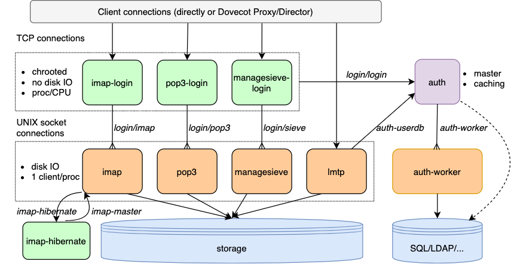

.. _dovecot_processes:

=================
Dovecot processes
=================

Dovecot is split into multiple processes where each process does only
one thing. This is partially because it makes the code cleaner, but also
because it allows setting up different privileges for each process. The
most important processes are:

-  Master process (dovecot)
-  Log process (log)
-  Config process (config)
-  Authentication process (auth)
-  Login processes (imap-login, pop3-login)
-  Mail processes (imap, pop3, lmtp)

Master process
--------------

This process keeps all the other processes running. If a child process
dies, another one is restarted automatically if necessary. The master
process runs as root, so its functionality is attempted to be kept minimal.

The master process is the only process that opens all inet, unix socket and
fifo listeners. These listener fds are then passed to child processes that
it forks.

Each service has a pipe that is used by the service's processes to send status
updates to master about how many client connections it can still accept.
If the master process sees that the service is completely full and can't
accept any more client connections, it logs a warning and eventually starts
rejecting the client connections for the service.

The login processes are special however: When master process notices that
all login processes are full, it instead notifies them about it. The login
processes then start closing their oldest connections in order to make space
for more client connections. This prevent DoSing the login services by simply
opening many idling connections.

Log process
-----------

Most of the logging is done via the log process. Only the master process
and processes that start up standalone (e.g. ``dovecot-lda``) bypass the log
process.

The Dovecot master process sets up a separate pipe for each service, which is
shared by all the processses of that service. The write side of the pipe
becomes the processes' stderr fd, while the read side is read by the log
process.

Log process has a few benefits over direct logging:

 * Log process can start throttling a service that logs too rapidly.
 * All stderr output logged by processes will be caught by the log process,
   so any errors printed by libraries will not be lost. These errors will
   also always have a log prefix showing which service caused the error.
 * Avoids duplicate log lines about crashes. If a panic is logged before a
   process crashes, there's no unnecessary line logged about process dying
   with signal 6.

Config process
--------------

The config processes parse the configuration file and feed the parsed output
in a simplified format to all the other processes via UNIX socket connections.

The master process reads its configuration in a different way: It first
executes the ``doveconf`` binary, which reads the configuration into
environment variables and then executes back the dovecot master binary.

Standalone tools like ``dovecot-lda`` and ``doveadm`` first try to read the
configuration via UNIX socket connection, but if that fails they do it by
executing ``doveconf``.

Authentication process
----------------------

The auth process handles everything related to the actual authentication:
SASL authentication mechanisms, looking up and verifying the passwords and
looking up user information.

There is only a single auth master process, which accepts all incoming
connections. This means that the auth process needs to be very efficient in
what it does and must not block for long or it will cause all the
authentications to hang.

To handle potentially long-running blocking operations there are auth worker
processes. These are often used for passdb and userdb lookups. The auth worker
processes can also be used for verifying password hashes, which may be
necessary if strong hashing algorithms are used.

Login processes
---------------

The login processes implement the required minimum of the IMAP, POP3,
ManageSieve or Submission protocols before a user logs in successfully.
Each protocol is handled by a separate process (and binary).

These processes are run with least possible privileges. Unfortunately
the default UNIX security model still allows them to do much more than
they would have to: Accept new connections on a socket, connect to new
UNIX sockets and read and write to existing file descriptors. Still, the
login process is by default run under a user account that has no special
access to anything, and runs inside a non-writable chroot where only a couple
of UNIX sockets exist. Doing any damage inside there to the server itself
should be difficult. It could of course still create connections to other
services that would normally be unavailable from external IP addresses.

When a new connection comes, one of the login processes accept()s it.
After that the client typically does nothing more than ask the server's
capability list and then log in. The client may also start TLS session
before logging in.

Authentication is done by talking to the authentication process. The
login process is untrusted by the authentication process, so
even if an attacker is able to execute arbitrary code inside a login
process, they won't be able to log in without a valid username and
password.

After receiving a successful authentication reply from the
authentication process, the login process connects to the mail process via
UNIX socket and sends the file descriptor it. The mail process verifies from
the auth process that the authentication really was successful.

By default each login process will handle only a single connection and
afterwards kill itself (but see SSL proxying below). This way attacker
can't see other people's connections. This can however be disabled, in which
case the security of the design suffers greatly.

The login processes handle SSL/TLS connections themselves completely.
They keep proxying the connection to mail processes for the entire
lifetime of the connection. This way if a security hole is found from
the SSL library, an authenticated user still can't execute code outside
the login process.

See :ref:`login_processes` for more information about different settings related to login
processes.

Mail processes
--------------

These processes handle the actual post-login mail handling using the
privileges of the logged in user.

Other processes
---------------

There are also various other processes commonly used:

 * anvil: Keep track of which mail processes handle which users
 * dict: Proxy process for dict lookups
 * dns-client: Asynchronous DNS lookups
 * imap-hibernate: IDLEing imap connections can be moved to hibernation processes.
 * indexer and indexer-worker: For full text search indexing
 * ipc: For communicating to login processes (a bit ugly, hopefully could be removed some day)
 * stats: Tracking statistics
